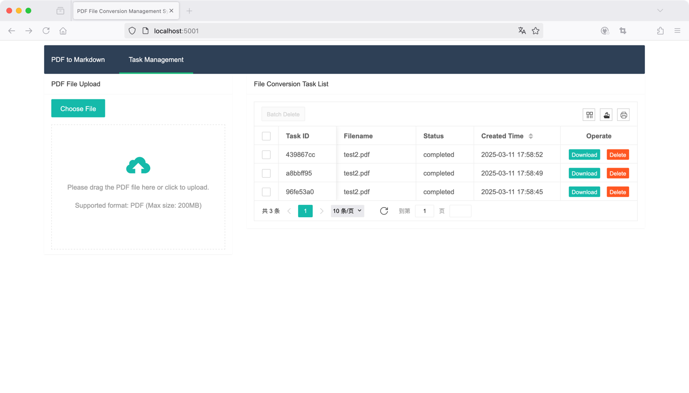

# magic-pdf-server

## A PDF to Markdown Conversion Service Based on MinerU's magic-pdf CLI

### How to Use?

#### 1. Start the Service

```shell
# Clone repository
git clone https://github.com/soja/magic-pdf-server.git
# Start service
cd magic-pdf-server/
docker-compose up -d
```

#### 2. Web Interface Preview

## MinerU Reference Documentation

https://github.com/opendatalab/MinerU/blob/master/README.md

### 1. Verify CUDA Environment
```bash
nvidia-smi
```

### 2. Installation
```bash
wget https://gcore.jsdelivr.net/gh/opendatalab/MinerU@master/docker/china/Dockerfile -O Dockerfile
docker build -t mineru:latest .
docker run -it --name mineru --gpus=all mineru:latest /bin/bash -c "echo 'source /opt/mineru_venv/bin/activate' >> ~/.bashrc && exec bash"
magic-pdf --help
```

#### MinerU Dockerfile Reference
```Dockerfile
# Use the official Ubuntu base image
FROM ubuntu:22.04

# Set environment variables to non-interactive
ENV DEBIAN_FRONTEND=noninteractive

# Install system dependencies
RUN apt-get update && \
    apt-get install -y \
        software-properties-common && \
    add-apt-repository ppa:deadsnakes/ppa && \
    apt-get update && \
    apt-get install -y \
        python3.10 \
        python3.10-venv \
        python3.10-distutils \
        python3-pip \
        wget \
        git \
        libgl1 \
        libglib2.0-0 \
        && rm -rf /var/lib/apt/lists/*

# Set Python 3.10 as default
RUN update-alternatives --install /usr/bin/python3 python3 /usr/bin/python3.10 1

# Create virtual environment
RUN python3 -m venv /opt/mineru_venv

# Install Python dependencies
RUN /bin/bash -c "source /opt/mineru_venv/bin/activate"
RUN /bin/bash -c "pip3 install --upgrade pip -i https://mirrors.aliyun.com/pypi/simple"
RUN /bin/bash -c "wget https://gcore.jsdelivr.net/gh/opendatalab/MinerU@master/docker/china/requirements.txt -O requirements.txt"
RUN /bin/bash -c "pip3 install -r requirements.txt --extra-index-url https://wheels.myhloli.com --ignore-installed"

# Configure magic-pdf
RUN /bin/bash -c "wget https://gcore.jsdelivr.net/gh/opendatalab/MinerU@master/magic-pdf.template.json"
RUN /bin/bash -c "cp magic-pdf.template.json /root/magic-pdf.json"
RUN /bin/bash -c "pip3 install -U magic-pdf -i https://mirrors.aliyun.com/pypi/simple"

# Download AI models
RUN /bin/bash -c "pip3 install modelscope"
RUN /bin/bash -c "wget https://gcore.jsdelivr.net/gh/opendatalab/MinerU@master/scripts/download_models.py -O download_models.py"
RUN /bin/bash -c "python3 download_models.py"
RUN /bin/bash -c "sed -i 's|cpu|cuda|g' /root/magic-pdf.json"

ENTRYPOINT ["/bin/bash", "-c", "source /opt/mineru_venv/bin/activate && exec \"$@\"", "--"]
```

#### Requirements.txt Content
```
boto3>=1.28.43
Brotli>=1.1.0
click>=8.1.7
PyMuPDF>=1.24.9,<=1.24.14
loguru>=0.6.0
numpy>=1.21.6,<2.0.0
fast-langdetect>=0.2.3,<0.3.0
scikit-learn>=1.0.2
pdfminer.six==20231228
unimernet==0.2.3
torch>=2.2.2,<=2.3.1
torchvision>=0.17.2,<=0.18.1
matplotlib
ultralytics>=8.3.48
paddleocr==2.7.3
struct-eqtable==0.3.2
einops
accelerate
rapidocr-paddle>=1.4.5,<2.0.0
rapidocr-onnxruntime>=1.4.4,<2.0.0
rapid-table>=1.0.3,<2.0.0
doclayout-yolo==0.0.2b1
openai
detectron2
```

#### download_models.py Reference
```python
import json
import os
import requests
from modelscope import snapshot_download

def download_json(url):
    response = requests.get(url)
    response.raise_for_status()
    return response.json()

def download_and_modify_json(url, local_filename, modifications):
    if os.path.exists(local_filename):
        data = json.load(open(local_filename))
        if data.get('config_version', '0.0.0') < '1.1.1':
            data = download_json(url)
    else:
        data = download_json(url)

    for key, value in modifications.items():
        data[key] = value

    with open(local_filename, 'w', encoding='utf-8') as f:
        json.dump(data, f, ensure_ascii=False, indent=4)

if __name__ == '__main__':
    mineru_patterns = [
        "models/Layout/LayoutLMv3/*",
        "models/Layout/YOLO/*",
        "models/MFD/YOLO/*",
        "models/MFR/unimernet_small_2501/*",
        "models/TabRec/TableMaster/*",
        "models/TabRec/StructEqTable/*",
    ]
    model_dir = snapshot_download('opendatalab/PDF-Extract-Kit-1.0', allow_patterns=mineru_patterns)
    layoutreader_model_dir = snapshot_download('ppaanngggg/layoutreader')
    model_dir += '/models'
    
    print(f'model_dir: {model_dir}')
    print(f'layoutreader_model_dir: {layoutreader_model_dir}')

    config_url = 'https://gcore.jsdelivr.net/gh/opendatalab/MinerU@master/magic-pdf.template.json'
    config_path = os.path.join(os.path.expanduser('~'), 'magic-pdf.json')

    download_and_modify_json(config_url, config_path, {
        'models-dir': model_dir,
        'layoutreader-model-dir': layoutreader_model_dir
    })
    print(f'Configuration file updated: {config_path}')
```

